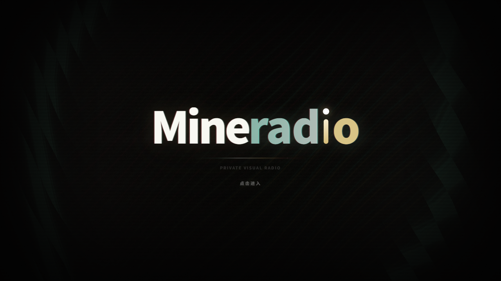

<h1 align="center">Mineradio</h1>

<p align="center">沉浸式音乐播放器 · 歌词舞台 · 粒子视觉 · 3D 歌单架</p>

<p align="center">
  <a href="#立即下载-windows-安装包">Windows 下载</a> ·
  <a href="#macos-install">macOS 下载与安装</a> ·
  <a href="#开发运行">开发运行</a> ·
  <a href="#作者支持">支持原作者</a>
</p>

<p align="center">
  <a href="https://github.com/XxHuberrr/Mineradio/releases/tag/v2.2.0"></a>
  
  <a href="https://github.com/Azure12355/Mineradio/releases/tag/v2.2.0-macos.1"></a>
  
  <a href="./LICENSE"></a>
</p>



Mineradio 是一款 Windows 桌面沉浸式音乐播放器，把搜索播放、歌词舞台、粒子视觉、3D 歌单架和完整桌面模式组合成一个更接近现场感的私人音乐空间。

> 本仓库基于 [XxHuberrr/Mineradio](https://github.com/XxHuberrr/Mineradio)，保留原作者的项目介绍、下载入口、支持渠道、使用说明、致谢与授权内容，并补充 macOS 适配。macOS 安装包由 [Azure12355](https://github.com/Azure12355/Mineradio) 提供，当前为测试版，不代表原作者正式发布。

## 目录

- [当前版本](#当前版本)
- [核心特性](#核心特性)
- [Windows 下载](#立即下载-windows-安装包)
- [macOS 下载与安装](#macos-install)
- [使用说明](#使用说明)
- [下载或安装被拦截怎么办](#下载或安装被拦截怎么办)
- [开发运行](#开发运行)
- [更新机制](#更新机制)
- [作者支持](#作者支持)
- [第三方音乐平台说明](#第三方音乐平台说明)
- [用户数据与隐私](#用户数据与隐私)
- [致谢](#致谢)
- [版权与授权](#版权与授权)

## 当前版本

当前版本：`2.2.0`

状态：Mineradio 2.2.0 正式版。

> 安全提示：`v1.0.10` 及更早旧安装包不再建议继续安装或传播。请使用本次公告提供的 `Mineradio-2.2.0-Setup.exe`。

以上版本与正式版状态为原作者发布信息。macOS 适配包独立标记为 `v2.2.0-macos.1` 测试版，兼容范围见下文。

## 核心特性

- 首页包含每日推荐、平台推荐、继续听、听歌画像和我的歌单入口
- 完整桌面模式保留播放器、主页、歌单和桌面交互
- 支持本地 MP4 与 Wallpaper Engine 视觉内容
- 播放后切换到 Emily / 默认播放态视觉，歌词舞台与粒子舞台同步工作
- 基于节奏的电影镜头视觉系统
- 面向长播客和 DJ 曲目的专属视觉模式
- 歌词舞台、自定义歌词、歌词位置与视觉控制
- 自定义专辑封面上传与裁剪
- 右键唤起 3D 歌单架，支持歌单队列浏览
- 网易云音乐账号、搜索、歌单、播客等体验接入
- QQ 音乐搜索、登录态与音源补充接入
- GitHub Releases 更新检测与下载入口
- 首次启动内置「默认测试」视觉用户存档，软件内默认视觉参数与该存档一致

## 立即下载 Windows 安装包

> 本次下载入口已更换，请使用下面的新网盘链接，并更新旧收藏。通过公告中的网盘入口下载，也是在支持 Mineradio 的持续更新。

| 下载入口 | 推荐人群 | 链接 |
| --- | --- | --- |
| 夸克盘 | 夸克用户 | [下载 Mineradio 2.2.0](https://pan.quark.cn/s/4b124d3e81d3) |
| 百度云 | 百度网盘用户（提取码 `SJHP`） | [下载 Mineradio 2.2.0](https://pan.baidu.com/s/17CwpHUza67w_Grgc3s5nOw?pwd=SJHP) |
| GitHub Release | 版本说明与源码 | [查看 Mineradio 2.2.0](https://github.com/XxHuberrr/Mineradio/releases/tag/v2.2.0) |

本页、发布公告和软件更新入口使用相同的两条新链接。旧分享地址不再作为本次版本的下载入口。

安装时只需要下载并运行 `Mineradio-2.2.0-Setup.exe`。不要把 `.blockmap`、`latest.yml` 或 `win-unpacked` 当成正式安装包。

2.1.0 用户如果未看到更新提醒，请从托盘彻底退出后重新打开软件，切回普通窗口，等待约 30 秒后查看右上角更新箭头。旧版不会自动弹出公告；也可以直接使用上面的新网盘链接下载安装包。

<a id="macos-install"></a>

## macOS 下载与安装

### 适用范围

| 项目 | 说明 |
| --- | --- |
| 版本 | `v2.2.0-macos.1`，基于 Mineradio 2.2.0 的 macOS 测试版 |
| 芯片 | Apple Silicon（M 系列），不适用于 Intel Mac |
| 系统 | macOS 12 或更新版本；已在 macOS 26.5 上验证应用启动 |
| 安装包 | `Mineradio-2.2.0-arm64.dmg`，约 128 MB |
| 签名状态 | 未进行 Apple Developer ID 签名与公证 |

### 下载入口

| 文件 | 链接 |
| --- | --- |
| DMG 安装包 | [下载 macOS Apple Silicon 版](https://github.com/Azure12355/Mineradio/releases/download/v2.2.0-macos.1/Mineradio-2.2.0-arm64.dmg) |
| 版本说明 | [查看本次 Release](https://github.com/Azure12355/Mineradio/releases/tag/v2.2.0-macos.1) |
| SHA-256 校验文件 | [下载 SHA256SUMS.txt](https://github.com/Azure12355/Mineradio/releases/download/v2.2.0-macos.1/SHA256SUMS.txt) |

### 安装步骤

1. 下载并打开 `Mineradio-2.2.0-arm64.dmg`。
2. 将 **Mineradio** 拖入 **应用程序（Applications）** 文件夹。
3. 从「应用程序」打开 Mineradio。使用安装包不需要另外安装 Node.js 或下载源码。
4. 如果 macOS 因未签名阻止打开，在确认下载来源后，进入「系统设置 → 隐私与安全性」，查看是否提供「仍要打开」。不要关闭系统安全机制；如果系统明确报告恶意软件，不要强行运行。

如需校验下载文件，将 DMG 和 `SHA256SUMS.txt` 放在同一目录，在该目录执行：

```bash
shasum -a 256 -c SHA256SUMS.txt
```

### macOS 操作与兼容性

- **全屏**：点击应用全屏按钮，或按 `Control + Command + F`；按 `Esc` 退出。
- **窗口恢复**：退出全屏时恢复原窗口位置和尺寸；显示器移除后，将恢复区域限制在可用屏幕内。
- **退出应用**：按 `Command + Q`，或使用应用菜单中的退出选项。
- **后台运行**：在应用中选择关闭到托盘后，关闭窗口会保留菜单栏入口。
- **系统行为**：使用 macOS 默认图形后端，支持系统编辑菜单与 Command 快捷键标识；隐藏、最小化由系统管理。

完整桌面嵌入、Wallpaper Engine 场景及 Windows 系统内存清理不支持 macOS。在线音乐平台功能仍取决于对应服务和账号权限。

**验证范围**：应用构建、实际启动和 DMG 镜像完整性检查已通过，53 项相关自动化检查通过。原生全屏动画、Dock、多屏、播放、登录、菜单/托盘及视觉效果尚未全部完成实机交互验收；请按测试版使用。

macOS 版本更新请前往 [本仓库 Releases](https://github.com/Azure12355/Mineradio/releases)。应用内现有更新入口仍指向原作者仓库，不能用于获取本 fork 的 macOS 测试包。

## 使用说明

以下为原作者的 Windows 使用说明；macOS 用户请参阅 [下载与安装](#macos-install)。

Windows 用户可以从本次发布公告列出的新网盘入口下载安装包。

正式分发以 `Mineradio-2.2.0-Setup.exe` 为准，不建议直接使用 `win-unpacked` 目录。安装包会创建桌面快捷方式。

已经安装过旧版本的用户可直接运行 `Mineradio-2.2.0-Setup.exe` 完成更新。软件内更新入口只会打开浏览器下载页，不会在客户端内下载或应用补丁。

## 下载或安装被拦截怎么办

以下为 Windows 下载与安装提示。macOS 未签名构建的打开方式见 [安装步骤](#安装步骤)。

小众 Electron 桌面软件、未签名安装包有时会被浏览器、Windows Defender 或 SmartScreen 提示风险。请先确认安装包来自本次公告的下载入口，文件名是 `Mineradio-2.2.0-Setup.exe`。

1. 浏览器下载栏提示风险时，打开下载列表，点这条下载右侧的 `...` 三个点，选择 `保留` / `仍要保留` / `显示更多` 后继续保留。
2. Windows SmartScreen 弹出蓝色拦截窗口时，点 `更多信息`，再点 `仍要运行`。
3. 如果杀毒软件明确显示木马、高危或已经隔离，不要强行运行；删除该文件后重新从上面的网盘入口下载，仍然异常请带截图反馈给作者。

## 开发运行

### Windows

```bash
npm install
npm start
npm run build:win
```

桌面版入口由 Electron 主进程加载本地服务。`npm run build:win` 会生成 Windows NSIS 安装包，产物位于 `dist/`。

### macOS（Apple Silicon）

需要原生 arm64 Node.js 22.12 或更新版本及 npm。在项目目录执行：

```bash
npm ci
npm start
```

`npm ci` 会通过安装脚本下载 Electron 运行时，需要能够访问 Electron 下载源。

构建应用或 DMG：

```bash
# 生成 .app
npm run build:mac:dir

# 生成 DMG 安装包
npm run build:mac
```

默认应用路径为 `dist/mac-arm64/Mineradio.app`，DMG 位于 `dist/`。构建命令复用本地已安装的 Electron，不重复下载运行时。默认构建未签名、未公证。

## 更新机制

Mineradio 会请求 GitHub Releases latest 检测新版本。远端版本高于本地版本时，应用内更新入口会展示 Release 内容，并通过系统浏览器打开可选网盘线路；即使 Release 附带完整安装包，`2.0.3+` 客户端也不会读取、下载、缓存或应用该附件与补丁。

本地验证更新链路时，可以通过 `MINERADIO_UPDATE_MANIFEST` 指向一个本地 manifest JSON 或 HTTP 地址来模拟线上 Release。

## 作者支持

如果 Mineradio 陪你多听了一首歌，也欢迎请作者一杯咖啡。

[查看完整支持页](./docs/SUPPORT.md)


Mineradio 2.2 修复音乐接口的登录与播放问题，改善歌单加载和网络异常恢复，并加入更多手势操作与粒子预设。

## 第三方音乐平台说明

Mineradio 不是网易云音乐、QQ 音乐或腾讯音乐娱乐集团的官方客户端，也不隶属于任何音乐平台。

项目中的第三方平台接入仅用于个人学习、本地客户端体验和用户自有账号的播放辅助。请遵守对应平台的用户协议、版权规则和会员权益规则。项目不会提供绕过付费、绕过会员、破解音质或重新分发音乐内容的能力。

## 用户数据与隐私

登录 Cookie、搜索历史、自定义封面、自定义歌词、节奏分析缓存等数据只应保存在本机用户数据目录或浏览器本地存储中，不应提交到仓库。

更多说明见 [PRIVACY.md](./PRIVACY.md)。

## 致谢

Mineradio 由 XxHuberrr 主要设计与打造。emily 作为早期视觉底层想法与 `emily` 视觉预设改进方向的共创者和灵感来源之一，特此感谢。

同时感谢小天才e宝、应春日、锋将军、軌跡、林中、骊、风痕、花椰菜🥦在早期体验、测试反馈和发布准备中的帮助。

## 版权与授权

Copyright (C) 2026 XxHuberrr.

本项目采用 GPL-3.0 授权。详见 [LICENSE](./LICENSE)。

MR Logo、Mineradio 名称、界面视觉设计与原创视觉表达归作者所有；第三方依赖和第三方服务分别遵循其各自授权与服务条款。
